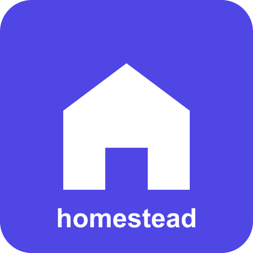

<div align="center">



# Homestead

**Build and deploy apps for you, your family, and your agents**

[website](https://myhomestead.dev)&nbsp; · &nbsp;[install](#install)&nbsp; · &nbsp;[quick start](#quick-start)&nbsp; · &nbsp;[apps](#included-apps)&nbsp; · &nbsp;[architecture](#architecture)&nbsp; · &nbsp;[agents](#agents-can-use-homestead-too)&nbsp; · &nbsp;[docs](packages/homestead-site/docs/guides/index.md)

</div>

---

Homestead is a self-hosted personal platform for your apps. Homestead starts
as your own personal database with an authenticated, standardized API. When
you're ready, you can add on CLI-based agent support, a React frontend, AI chatbots,
and more.

## Install

macOS or Linux, x64 or arm64. Requires [Node.js](https://nodejs.org) 22.13 or
newer:

```bash
npm install -g @rambleraptor/homestead-cli
```

That puts the `homestead` command on your `PATH`. Prefer not to install
globally? Run it on demand with `npx`:

```bash
npx @rambleraptor/homestead-cli init my-home
```

## Features

An app is a folder with an `app.config.ts`. Declare the data it stores and
Homestead gives you the database schema, a typed REST API, and the plumbing
below — you write the React and nothing else.

- **[Resources](packages/homestead-site/docs/guides/resources.md)** — declare
  your fields; Homestead creates the tables and an AEP-compliant REST API to
  read and write them. Add a field, restart, and the schema follows.
- **[Authentication](packages/homestead-site/docs/guides/users.md)** —
  email/password or OAuth, with
  [tags](packages/homestead-site/docs/guides/access.md) to control which people
  can reach which apps.
- **[Offline support](packages/homestead-site/docs/guides/offline.md)** — the
  basement, the car, the cabin. Edits queue locally and sync when you're back.
- **[AI](packages/homestead-site/docs/guides/ai.md)** — an optional chatbot
  wired into your data, backed by OpenAI, Anthropic, or Gemini.
- **CLI** — `homestead` scaffolds a project, runs the stack, and installs the
  systemd service. Your agents can drive the same API from the terminal, and
  only see what you let them.
- **[Push notifications](packages/homestead-site/docs/guides/notifications.md)**
  — nudge the whole house, or just yourself.
- **[Bulk import](packages/homestead-site/docs/guides/bulk-import.md)** — CSV
  upload for any app, by configuration only.
- **[Dashboard widgets](packages/homestead-site/docs/guides/widgets.md)** - Apps
  can have widgets on the homepage and they can be personalized per-user.

## Included Apps

Homestead began as a way for me to easily build personal apps. I ship all
of my personal apps in the @rambleraptor/homestead-apps package. This includes:

- Todos and projects
- Groceries with notifications and image processing
- People and shared personal data
- Recipes
- Gift card tracking
- Credit card perk tracking
- HSA receipt upload
- Games and small social scorekeepers

Each is an opt-in **app** — turn it on by editing `homestead.config.ts`. Want a
different mix, or your own custom app? See the
**[docs](packages/homestead-site/docs/guides/index.md)**. The `create-app`
skill scaffolds a new app end-to-end (resources, hooks, components, config
wiring, and e2e fixtures).

## Docs

- [Quick Start](packages/homestead-site/docs/guides/quick-start.md)
- [Installation](packages/homestead-site/docs/guides/installation.md)
- [Defining Resources](packages/homestead-site/docs/guides/resources.md)
- [State Management](packages/homestead-site/docs/guides/state-management.md)
- [Dashboard Widgets](packages/homestead-site/docs/guides/widgets.md)
- [Notifications](packages/homestead-site/docs/guides/notifications.md)
- [AI Support](packages/homestead-site/docs/guides/ai.md)
- [Creating Users](packages/homestead-site/docs/guides/users.md)
- [Access & Tags](packages/homestead-site/docs/guides/access.md)

## Development

Working on Homestead itself requires the source toolchain:

- **Node.js 20+ and npm** — builds the SPA
- **Bun** — runs and compiles the server + CLI ([install](https://bun.sh))

```bash
git clone https://github.com/rambleraptor/homestead.git
cd homestead
make homestead          # builds ./bin/homestead for your current platform
make release            # cross-compiles release binaries
```

Use `make start` to build and run the source checkout in one step. The full
contributor workflow and the make targets (`make ci`, `make test`,
`make test-e2e`) live in [CLAUDE.md](CLAUDE.md).

## License

MIT License
